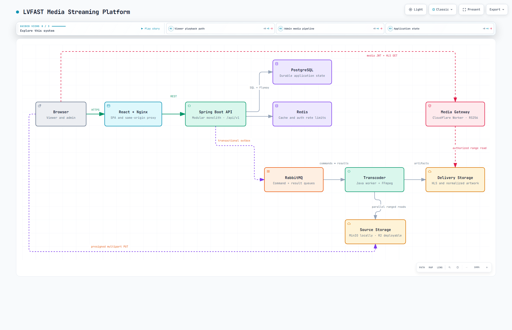

# LVFAST Media Streaming Platform

A full-stack movie streaming reference application with a public viewing experience, an admin media workflow, asynchronous FFmpeg processing, and token-protected HLS delivery.

LVFAST is built as a portfolio and systems-engineering project: it demonstrates authenticated product flows, direct-to-object-storage uploads, reliable background jobs, immutable media publication, and a disposable local verification environment. The checked-in catalog and media fixtures are synthetic and resettable.

## Table of contents

- [Features](#features)
- [System architecture](#system-architecture)
- [Technology stack](#technology-stack)
- [Quick start](#quick-start)
- [Run the complete media stack](#run-the-complete-media-stack)
- [Configuration](#configuration)
- [Development](#development)
- [Testing and verification](#testing-and-verification)
- [API contract](#api-contract)
- [Repository layout](#repository-layout)
- [Security and reliability](#security-and-reliability)
- [Known limitations](#known-limitations)

## Features

### Viewer experience

- Responsive React single-page application with landing, browse, search, movie-detail, watchlist, and player routes.
- Home rails and catalog search backed by PostgreSQL with a disposable Redis read-through cache.
- Twenty synthetic movies and three checked-in HLS fixtures for a predictable local demo.
- Per-user watchlist with idempotent add and remove operations.
- Last-write-wins playback progress, completion at 90%, and resume-from-zero behavior for completed titles.
- HLS.js playback with lazy-loaded player code and byte-range media requests.
- Dedicated loading, empty, error, authorization, and not-found states.

### Identity and sessions

- Username/password registration, login, current-user lookup, token refresh, and logout.
- Argon2id password hashing and normalized usernames.
- Short-lived RS256 access tokens held only in browser memory.
- Opaque refresh tokens stored as hashes, rotated on use, and delivered through an HttpOnly cookie.
- Refresh-token family revocation when reuse is detected.
- Redis-backed rate limiting for registration, login, and refresh operations.
- Database-backed role lookup so administrator revocation takes effect without waiting for an access token to expire.

### Administration

- Role-protected admin application under `/admin`.
- Film library with create, edit, review, and lifecycle workflows.
- Optimistic concurrency through revision-aware updates and `If-Match`; stale writes are rejected instead of silently overwriting another editor.
- Draft publication, version activation, unpublish, archive, and restore actions.
- Preview sessions that do not alter a viewer's personal playback progress.
- Poster and backdrop selection from verified processed assets.
- Job monitoring, job-detail polling, and manual retry for eligible failures.
- Searchable audit trail for administrative actions.
- Operator-only bootstrap command for granting or revoking the `ADMIN` role; public registration never accepts roles.

### Direct uploads and media processing

- Resumable multipart uploads for video, poster, and backdrop sources.
- Browser-to-storage part uploads through presigned URLs; storage credentials are never returned to the browser.
- Resume journal and file fingerprinting in the admin client.
- Separate source and delivery buckets with backend-owned object keys.
- Durable RabbitMQ command and result queues.
- Independent Java transcoder with no database dependency.
- FFprobe validation and FFmpeg H.264/AAC HLS generation.
- Deterministic artwork normalization for poster and backdrop profiles.
- Parallel 16 MiB byte-range downloads for large sources with four workers and bounded per-range retries.
- Immutable attempt-scoped output prefixes; `artifact.json` is written last.
- Backend verification of artifact metadata and stored objects before a version or asset becomes `READY`.

### Protected media delivery

- Dedicated Cloudflare Worker media gateway with an R2 `DELIVERY` binding.
- Short-lived RS256 media tokens bound to the movie, media version, attempt prefix, session, and purpose.
- Strict allowlist for HLS manifests, transport-stream segments, and public normalized artwork.
- Single-range `GET` and `HEAD` support with `206`, `Content-Range`, and `Accept-Ranges`.
- Protected HLS is streamed with `private, no-store`; public artwork uses a bounded shared-cache policy.
- Exact-origin CORS allowlist and generic error responses that do not disclose token or storage details.
- The gateway receives public verification keys only—never a signing private key or S3 credential.

### Reliability and delivery engineering

- Transactional outbox for durable job publication.
- Manual RabbitMQ acknowledgements so work is acknowledged only after a terminal or successfully executed decision.
- Worker claims, attempt numbers, leases, heartbeats, lease-expiry recovery, bounded retry waits, and terminal failure handling.
- Result inbox deduplication plus monotonic sequence and attempt fencing to ignore duplicate, late, or stale events.
- Idempotent multipart completion across the storage-completed/API-response-lost crash window.
- RFC 9457 `application/problem+json` API failures with stable codes and request IDs.
- Health checks, resource limits, read-only container filesystems, dropped Linux capabilities, and `no-new-privileges` where practical.
- CI for backend, transcoder, frontend, API-client drift, Compose and Nginx configuration, HTTP acceptance, container builds, Trivy scans, and immutable release images with provenance attestations.

## System architecture

The browser loads the React application through Nginx and calls the Spring Boot API under `/api/v1`. PostgreSQL is the durable source of truth; Redis contains only replaceable cache and rate-limit data.

Admin media files bypass the API data plane after authorization: the backend creates presigned multipart operations, and the browser uploads parts directly to source storage. A transactional outbox publishes processing commands to RabbitMQ. The transcoder claims each job, downloads its source, runs FFprobe/FFmpeg or artwork normalization, writes immutable delivery artifacts, and publishes progress or terminal results. The backend verifies successful output before exposing it.

For playback, the backend issues a short-lived, path-bound media token. The browser presents it to the media gateway, which authenticates and authorizes the request before reading from delivery storage.

<a href="docs/diagrams/lvfast-system-architecture.html">
  <picture>
    <source media="(prefers-color-scheme: dark)" srcset="docs/diagrams/lvfast-system-architecture.dark.png">
    
  </picture>
</a>

[Open the interactive architecture diagram](docs/diagrams/lvfast-system-architecture.html) · [View its typed JSON source](docs/diagrams/lvfast-system-architecture.json) · [Read the browser-validation receipt](docs/diagrams/lvfast-system-architecture.visual-check.json)

| Component | Responsibility |
| --- | --- |
| React + Nginx | Serves the SPA, applies browser security headers, proxies same-origin API requests, and serves local fixtures. |
| Spring Boot backend | Owns identity, catalog, library, playback, administration, uploads, publication, audit, and durable job state. |
| PostgreSQL | Stores users, refresh sessions, catalog records, watchlists, progress, media versions/assets, uploads, jobs, inbox/outbox events, and audit records. |
| Redis | Holds disposable catalog cache entries and authentication rate-limit counters. |
| RabbitMQ | Carries durable media commands and worker result events. |
| Transcoder | Downloads private sources, probes and processes media, uploads immutable artifacts, and reports progress. |
| Source storage | Private S3-compatible bucket for original admin uploads; MinIO locally and Cloudflare R2-compatible in deployments. |
| Delivery storage | Private bucket for verified HLS and artwork output. |
| Media gateway | Verifies media JWTs, binds claims to canonical paths, enforces CORS/range rules, and streams authorized delivery objects. |

The backend is organized as a modular monolith. The transcoder and media gateway are separate deployable components with narrower privileges and no direct database access.

## Technology stack

| Area | Technologies |
| --- | --- |
| Web client | React 19, TypeScript 6, Vite 8, React Router 7, HLS.js, Lucide React |
| Web edge | Nginx with runtime-rendered CSP configuration |
| Backend | Java 21, Spring Boot 4, Spring Security, JDBC, Flyway, Actuator |
| Durable state | PostgreSQL 17 |
| Cache and limits | Redis 7.4 |
| Messaging | RabbitMQ 4 / AMQP |
| Media worker | Java 21, AWS SDK for S3-compatible storage, FFprobe, FFmpeg |
| Media delivery | TypeScript, Cloudflare Workers, R2 bindings, `jose`, Wrangler |
| API tooling | OpenAPI 3.1 and a generated `@hey-api/openapi-ts` frontend client |
| Verification | JUnit, Testcontainers, ArchUnit, Vitest, Testing Library, Playwright, Python harnesses, k6, Trivy, actionlint |
| Packaging | Docker Compose, multi-stage container images, GHCR release workflow |

## Quick start

### Prerequisites

For the containerized core application:

- Docker Engine or Docker Desktop.
- Docker Compose v2.

Host-side development and verification additionally use:

- Java 21 and Maven 3.9+.
- Node.js 22.22.2 or newer with npm.
- Python 3.10+.
- FFmpeg for media-pipeline smoke and acceptance scenarios.
- Google Chrome, Microsoft Edge, or Playwright Chrome for browser-level media acceptance.

### Start the core demo

From the repository root:

```sh
docker compose --env-file .env.example -f compose.yml -f compose.local.yml up -d --build
```

Open <http://localhost:8080>.

This stack starts the frontend/Nginx entrypoint, Spring Boot backend, PostgreSQL, and Redis. It imports the versioned synthetic catalog and serves the three checked-in fixtures under `/media/`.

Inspect the stack:

```sh
docker compose --env-file .env.example -f compose.yml -f compose.local.yml ps
docker compose --env-file .env.example -f compose.yml -f compose.local.yml logs -f backend frontend
```

Stop it while retaining PostgreSQL data and generated local signing keys:

```sh
docker compose --env-file .env.example -f compose.yml -f compose.local.yml down
```

Add `--volumes` only when intentionally resetting local database data and keys.

## Run the complete media stack

The media overlay adds MinIO, RabbitMQ, and the transcoder:

```sh
docker compose --env-file .env.example -f compose.yml -f compose.local.yml -f compose.media.local.yml up -d --build
```

The application remains at <http://localhost:8080>. MinIO exposes its S3 API at <http://127.0.0.1:9000> and console at <http://127.0.0.1:9001>. RabbitMQ stays on the internal application network.

The backend and worker deliberately do not create buckets. Create `media-source` and `media-delivery` once by following the [local media runbook](docs/runbooks/media-local.md#create-the-buckets).

To use the admin UI:

1. Register a normal account in the application.
2. Grant it `ADMIN` with the operator procedure in the [admin bootstrap runbook](docs/runbooks/admin-bootstrap.md).
3. Open `/admin`, create or edit a draft, and upload video/artwork from its Upload page.
4. Track processing under `/admin/jobs`, review verified media, attach artwork, and publish the movie.

Focused worker smoke checks are available after the full stack and buckets are ready:

```powershell
powershell -NoProfile -ExecutionPolicy Bypass -File scripts/worker-smoke.ps1
powershell -NoProfile -ExecutionPolicy Bypass -File scripts/artwork-smoke.ps1
```

For the browser-complete nine-step workflow, use the [admin media acceptance runbook](docs/runbooks/admin-media-acceptance.md).

## Configuration

`.env.example` contains safe local-development defaults. To customize them, copy it to `.env`, keep the copy out of version control, and replace `--env-file .env.example` with `--env-file .env`.

### Core application

| Variable | Purpose | Local default |
| --- | --- | --- |
| `POSTGRES_DB` | PostgreSQL database name | `media_streaming` |
| `POSTGRES_USER` | PostgreSQL application user | `media_streaming` |
| `POSTGRES_PASSWORD` | PostgreSQL password | `local-only-change-me` |
| `MEDIA_BASE_URL` | Optional absolute prefix used to resolve stored `/media/...` catalog references | empty |
| `SECURE_COOKIE` | Requires HTTPS for the refresh cookie | `false` |
| `REFRESH_COOKIE_NAME` | Refresh-cookie name | `refresh_token` |

### Processing and object storage

| Variable | Purpose | Local default |
| --- | --- | --- |
| `MEDIA_SOURCE_BUCKET` | Original upload bucket | `media-source` |
| `MEDIA_DELIVERY_BUCKET` | Verified output bucket | `media-delivery` |
| `MEDIA_WORKER_CREDENTIAL` | Shared machine credential used by backend and worker | local-only value |
| `WORKER_ID` | Worker identity recorded on job attempts | `worker-1` |
| `RABBITMQ_USERNAME`, `RABBITMQ_PASSWORD` | AMQP credentials | local-only values |
| `S3_ENDPOINT` | Backend/worker S3-compatible endpoint | `http://minio:9000` |
| `S3_BROWSER_ENDPOINT` | Browser-reachable endpoint used while signing upload parts | `http://127.0.0.1:9000` |
| `S3_REGION` | S3-compatible region | `us-east-1` |
| `S3_ACCESS_KEY`, `S3_SECRET_KEY` | Internal backend/worker storage role | MinIO local credentials |
| `S3_BROWSER_ACCESS_KEY`, `S3_BROWSER_SECRET_KEY` | Signing-only upload role | MinIO local credentials |

### Cross-origin playback and upload

| Variable | Purpose |
| --- | --- |
| `VITE_MEDIA_BASE_URL` | Media-gateway origin embedded into the frontend bundle at build time. |
| `MEDIA_ORIGIN` | The same media-gateway origin inserted into Nginx `connect-src` at container start. |
| `MEDIA_STORAGE_ORIGIN` | Browser-facing source-storage origin inserted into Nginx `connect-src` for presigned uploads. |
| `MEDIA_SIGNING_KEY_ID` | Media-token `kid`; must match the public JWK configured at the gateway. |

For Cloudflare R2, use private source and delivery buckets, `S3_REGION=auto`, the R2 account endpoint, and separate internal and signing-only credentials. The web bundle, CSP, source-bucket CORS, gateway allowlist, and token `kid` must agree. See the [rollout runbook](docs/runbooks/admin-media-rollout.md) and [media gateway runbook](docs/runbooks/media-gateway.md); neither runbook provisions or deploys resources automatically.

Never reuse the example passwords, worker credential, MinIO root credentials, or development keys in a deployed environment.

## Development

### Frontend

```sh
cd frontend
npm ci
npm run dev
npm test
npm run build
npm run check:api
```

The Vite development server listens on <http://localhost:5173>. It proxies `/api` to the backend and `/media` to the local fixture server configured by the frontend project.

### Backend

```sh
mvn -f backend/pom.xml --batch-mode --no-transfer-progress test
```

Flyway owns the schema. The backend uses explicit JDBC repositories and package boundaries checked by ArchUnit. Tests that require Docker use Testcontainers and skip when Docker is unavailable.

### Transcoder

```sh
mvn -f transcoder/pom.xml --batch-mode --no-transfer-progress test
```

The worker expects RabbitMQ, backend worker endpoints, FFmpeg/FFprobe, and S3-compatible source/delivery storage. It does not read PostgreSQL directly.

### Media gateway

```sh
cd media-gateway
npm ci
npm test
npm run typecheck
npm run dev
```

`wrangler dev` requires a usable local or remote R2 binding before it can serve objects. See [media-gateway.md](docs/runbooks/media-gateway.md) for keys, routes, CORS, byte ranges, deployment, and troubleshooting.

## Testing and verification

### Repository tooling

```sh
python -m unittest discover -s scripts/tests -p "test_*.py" -v
```

### Core HTTP acceptance and bounded load

Preview without creating Docker resources:

```sh
python scripts/run_acceptance.py
```

Run the short profile:

```sh
python scripts/run_acceptance.py --apply --quick
```

Run the complete local profile:

```sh
python scripts/run_acceptance.py --apply
```

The complete profile runs API acceptance and a bounded 20-VU, 10-minute k6 workload against an isolated Compose project. Its thresholds describe that local run, not a production SLO. Sanitized aggregate evidence is written under `artifacts/acceptance/`.

### Complete admin media acceptance

```sh
python scripts/run_media_acceptance.py
python scripts/run_media_acceptance.py --apply
```

The applied run builds the real workspace images and exercises the complete upload, resume, processing, preview, publication, protected playback, replacement, lifecycle, authorization, and audit journey in a disposable environment. It writes a redacted report under `artifacts/media-acceptance/` and removes only the Compose project it created.

### Processing recovery and protected playback

```sh
python tests/media-pipeline/test_recovery.py -v
python tests/media-pipeline/test_playback.py -v
```

These harnesses cover worker death after claim, duplicate and late results, completion-response loss, and browser decoding through the production media-gateway code. See [tests/media-pipeline/README.md](tests/media-pipeline/README.md) for dependencies and focused scenarios.

### Configuration checks

```sh
docker compose --env-file .env.example -f compose.yml -f compose.local.yml config --quiet
docker compose --env-file .env.example -f compose.yml -f compose.local.yml -f compose.media.local.yml config --quiet
```

The [local acceptance runbook](docs/runbooks/local-acceptance.md) documents the full backend, frontend, Nginx, Compose, workflow, dependency-audit, and evidence commands used by CI.

## API contract

The checked-in [OpenAPI 3.1 contract](docs/api/openapi.yaml) is the source for public schemas and status codes. The generated TypeScript client is committed under `frontend/src/api/generated`; CI regenerates it and rejects drift.

All application endpoints are rooted at `/api/v1`.

| Area | Representative operations |
| --- | --- |
| Identity | Register, login, refresh, logout, and current user. |
| Catalog | Home rails, movie details, and search. |
| Library | Read, add, and remove watchlist entries. |
| Playback | Resolve playback, refresh viewer/preview media tokens, and update progress. |
| Admin catalog | List, create, read, and revision-aware update of managed movies and genres. |
| Uploads | Create, inspect, sign parts, list parts, complete, and abort multipart sessions. |
| Media | List versions/assets, preview assets, attach artwork, and inspect/retry jobs. |
| Lifecycle | Preview, publish, activate a replacement, unpublish, archive, and restore. |
| Audit | Paginated administrative audit events. |

List responses use `{items, page, size, total}`. API failures use RFC 9457 Problem Details with a stable LVFAST URN type, machine-readable `code`, request ID, and optional field errors.

## Repository layout

```text
.
├── backend/                 Java 21 / Spring Boot modular monolith
├── frontend/                React/Vite viewer and admin SPA, served by Nginx
├── transcoder/              Independent Java/FFmpeg media worker
├── media-gateway/           Cloudflare Worker for authorized delivery reads
├── media/                   Synthetic artwork and local HLS fixtures
├── docs/api/                OpenAPI 3.1 contract
├── docs/diagrams/           Archify source, interactive diagram, images, and receipts
├── docs/runbooks/           Local, admin, gateway, acceptance, and rollout procedures
├── scripts/                 Safe acceptance runners and focused smoke scripts
├── tests/acceptance/        HTTP and k6 scenarios
├── tests/media-pipeline/    Recovery and protected-playback integration harnesses
├── compose.yml              Hardened core service model
├── compose.local.yml        Local builds, keys, and loopback entrypoint
└── compose.media.local.yml  Local MinIO, RabbitMQ, and transcoder overlay
```

Deployment host configuration, provider credentials, DNS, routes, and retained production data intentionally live outside this repository.

## Security and reliability

- Nginx is the only core service published by the standard local stack; backend, PostgreSQL, and Redis stay on an internal network.
- Containers drop capabilities, enable `no-new-privileges`, declare resource/PID limits, and use read-only filesystems where the service permits it.
- Login and media tokens use separate RSA key pairs, issuers, audiences, lifetimes, and purposes.
- Access tokens remain in memory; refresh tokens use HttpOnly cookies; media tokens are scoped to canonical immutable paths.
- The gateway authenticates, authorizes, validates paths, and validates ranges before reading storage.
- Source objects are private. Delivery HLS is private. Only normalized public artwork has an anonymous route.
- Admin uploads use presigned operations and exact-origin CORS; browser code never receives storage credentials.
- PostgreSQL remains authoritative. Redis failures may bypass catalog caching, while security-sensitive rate-limit failures fail closed.
- Outbox, inbox, leases, retry waits, idempotency keys, and optimistic revisions make retries explicit and prevent stale state transitions.
- Request IDs are returned with API problems and included in structured backend logs.

## Known limitations

- This is a synthetic, resettable reference application, not a commercial streaming service or a durable customer-data system.
- The transcoder currently produces one H.264/AAC HLS rendition rather than an adaptive bitrate ladder.
- The gateway supports canonical top-level HLS manifests and `segment_NNNNN.ts` files, one byte range per request, and no conditional `If-Range` behavior.
- DRM, billing, subscriptions, profiles, series/episodes, recommendations, ratings, email workflows, and social features are outside the current scope.
- Local acceptance does not prove broad browser/device compatibility, accessibility conformance, production capacity, production disaster recovery, or provider-side deployment correctness.
- Cloudflare R2, Worker routing, WAF behavior, edge caching, and production CORS must be verified separately in an authorized staging environment.
- The local load profile is a repeatable smoke criterion, not a capacity study or service-level objective.

## License

Licensed under the [MIT License](LICENSE).
