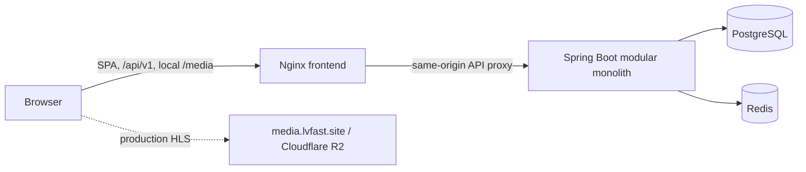

# Architecture

## Scope

LVFAST is a public, resettable movie-streaming demo. It supports guest catalog browsing and search plus username/password authentication, a per-user watchlist, HLS playback metadata, and resume progress. The catalog contains 20 synthetic records and three legally distributable local HLS fixtures.

Profiles, series, administration, recommendations, ratings, email, transcoding, DRM, billing, and durable customer-data guarantees are outside the MVP. Accounts and viewing history may be reset; the project has no RPO or RTO commitment.

## Runtime shape

Nginx serves the React SPA, adds browser security headers, proxies `/api/` to the backend, and serves local fixture media. The frontend is generated against the checked-in [OpenAPI 3.1 contract](api/openapi.yaml). Access tokens remain in browser memory; the browser sends the refresh cookie automatically.

The Java 21/Spring Boot application is a modular monolith with four domain packages:

| Module | Responsibility | Durable records |
| --- | --- | --- |
| Identity | registration, login, JWT issue, refresh rotation/reuse response, logout | users and hashed refresh sessions |
| Catalog | manifest import, home rails, movie details, PostgreSQL search | movies, genres, and links |
| Library | idempotent watchlist reads/adds/removes | watchlist entries |
| Playback | playable metadata, last-write-wins progress, 90% completion | viewing progress |

PostgreSQL is the source of truth and Flyway owns schema migrations. The versioned catalog manifest is imported idempotently. Redis stores only disposable ten-minute catalog cache entries and authentication rate-limit counters.

## API behavior

All application endpoints are under `/api/v1`. Registration, login, refresh, logout, catalog home, movie detail, and search are public. Current user, watchlist, playback, and progress require an RS256 bearer access token. List responses use `{items,page,size,total}`. Failures use `application/problem+json` with a stable `code`, a request ID, and optional field errors. See the [public OpenAPI file](api/openapi.yaml) for exact schemas and status codes.

| Area | Routes |
| --- | --- |
| Identity | `POST /auth/register`, `/auth/login`, `/auth/refresh`, `/auth/logout`; `GET /auth/me` |
| Catalog | `GET /catalog/home`, `/movies/{slug}`, `/search` |
| Library | `GET /me/watchlist`, `PUT` or `DELETE /me/watchlist/{movieId}` |
| Playback | `GET /movies/{movieId}/playback`, `PUT /me/progress/{movieId}` |

Watchlist writes are idempotent. Progress updates validate position and duration, apply the newest client timestamp, and mark a movie completed at 90%; completed playback resumes at zero.

## Security and failure behavior

- Passwords are hashed with Argon2id. Usernames contain 3–32 letters, digits, or underscores and are normalized to lowercase. Passwords contain 12–128 characters with at least one uppercase letter, lowercase letter, and digit.
- Access tokens are RS256 JWTs valid for 15 minutes. Opaque refresh tokens have 256 bits of entropy, live for seven days, are stored only as SHA-256 hashes, rotate on refresh, and revoke their token family when reuse is detected.
- Production refresh cookies are `HttpOnly`, `Secure`, `SameSite=Strict`, host-only `__Host-` cookies. The local overlay deliberately disables `Secure` and uses `refresh_token` because it serves loopback HTTP.
- Register, login, and refresh each allow 10 attempts per source IP per minute. If Redis is unavailable, these authentication actions fail closed with 503. Catalog reads bypass a failed cache and continue against PostgreSQL.
- The backend and frontend runtime images and Redis run with unprivileged users, dropped capabilities, read-only filesystems where applicable, resource limits, and `no-new-privileges`. PostgreSQL is the documented exception: its official entrypoint begins as root for volume ownership, retains only the transition capabilities, and drops to `postgres`.
- Production uses same-origin API requests and does not enable application CORS. Public media has a separate read-only R2 CORS policy. Nginx sets CSP, frame, content-type, referrer, and permissions headers.
- PostgreSQL failure makes readiness fail. A dedicated management listener in the host-operations bundle exposes only health and Prometheus endpoints on an internal monitoring network. Backend structured logs include request IDs and are designed to omit credentials, cookies, authorization headers, request bodies, and raw query strings. Nginx access logs contain request lines through `$request`, including query strings, so clients must never put secrets in URLs or query parameters.

## Delivery, deployment, and observability

The public repository's CI tests backend and frontend code, checks generated-client drift and configuration, performs dependency/security scans, builds images, and runs disposable local acceptance. Tagged releases publish immutable GHCR images. These workflows do not deploy a host or apply Cloudflare infrastructure.

The [prod-host-ops bundle](../infra/prod-host-ops/README.md) is a template to port into the private operations repository. Its protected workflow temporarily joins Tailscale, uses strict SSH host-key verification, and invokes a fixed root-owned deployment entrypoint. Host deployment records immutable frontend/backend digests, validates readiness and observability, and restores the prior image pair if verification fails. Image rollback does not reverse Flyway migrations or restore database data, so migrations must remain backward compatible.

Prometheus, Grafana, Loki, and Alloy have explicit memory and retention limits. Monitoring has no public host ports; external alert delivery is not configured. Live host ownership/filesystem capacity, SSH/Tailscale policy, deployment and rollback, public routing, and alert delivery still require operator acceptance.

Production media is designed for immutable releases on Cloudflare R2 behind `media.lvfast.site`. The bucket, CORS, custom domain, and disabled managed endpoint were applied during Task 6, but the cache rule, upload, and live CDN cache/range/CORS checks remain pending. The [Cloudflare R2 runbook](runbooks/cloudflare-r2-media.md) governs planning, publication, rollback, cleanup, and cost review. Its free-tier figures are allowances rather than a spending cap and must be rechecked before a live change.

## Known limitations

- The dataset is small, synthetic, and resettable; local fixtures exercise transport but do not represent a commercial media library.
- Acceptance covers API behavior and local HLS/range delivery. Manual browser decoding, adaptive playback quality, accessibility review, and broad device/browser compatibility are not automated acceptance evidence.
- The load profile is a bounded smoke test on fixture data, not a sizing study or production service-level objective.
- No DRM, transcoding, upload/admin workflow, profiles, series, recommendations, ratings, email, billing, or customer-data recovery exists.
- The public repository can validate release and operations assets, but only the private operations environment can prove live host deployment, rollback, routing, storage bounds, and notifications.
- Cloudflare media acceptance is partial until the pending cache rule, publication, and live CDN checks complete.
