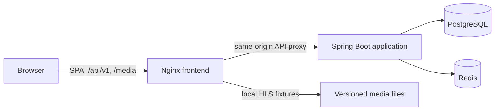

# Architecture

## Scope

LVFAST is a resettable movie-streaming demo. It supports guest catalog browsing and search, username/password authentication, a per-user watchlist, HLS playback metadata, and resume progress. The catalog contains 20 synthetic records and three local HLS fixtures.

Profiles, series, administration, recommendations, ratings, email, transcoding, DRM, billing, and durable customer-data guarantees are outside the application scope.

## Local runtime

Nginx is the only service published to the host, at `127.0.0.1:8080`. It serves the React single-page application, proxies `/api/` to the backend, and serves `/media/` from the checked-in fixtures. The backend, PostgreSQL, and Redis communicate on an internal Compose network.

The frontend client is generated from the checked-in [OpenAPI 3.1 contract](api/openapi.yaml). Access tokens remain in browser memory, while the browser sends the backend-managed refresh cookie automatically.

## Application modules

The Java 21/Spring Boot backend is a modular monolith with four domain packages:

| Module | Responsibility | Durable records |
| --- | --- | --- |
| Identity | Registration, login, JWT issue, refresh rotation and reuse response, logout | Users and hashed refresh sessions |
| Catalog | Manifest import, home rails, movie details, PostgreSQL search | Movies, genres, and links |
| Library | Idempotent watchlist reads, additions, and removals | Watchlist entries |
| Playback | Playable metadata and last-write-wins progress | Viewing progress |

PostgreSQL is the source of truth, and Flyway owns schema migrations. Startup imports the versioned catalog manifest idempotently. Redis stores only disposable ten-minute catalog cache entries and authentication rate-limit counters. Catalog reads fall back to PostgreSQL when the cache is unavailable.

## API behavior

All application endpoints are under `/api/v1`. Registration, login, refresh, logout, catalog home, movie detail, and search are public. Current-user, watchlist, playback, and progress operations require an RS256 bearer access token. List responses use `{items,page,size,total}`. Failures use RFC 9457 `application/problem+json` documents with stable LVFAST URN types, a `code`, a request ID, and optional field errors.

| Area | Routes |
| --- | --- |
| Identity | `POST /auth/register`, `/auth/login`, `/auth/refresh`, `/auth/logout`; `GET /auth/me` |
| Catalog | `GET /catalog/home`, `/movies/{slug}`, `/search` |
| Library | `GET /me/watchlist`; `PUT` or `DELETE /me/watchlist/{movieId}` |
| Playback | `GET /movies/{movieId}/playback`; `PUT /me/progress/{movieId}` |

Watchlist writes are idempotent. Progress updates validate position and duration, accept only the newest client timestamp, mark a movie completed at 90%, and resume completed playback from zero. The [API contract](api/openapi.yaml) defines exact schemas and status codes.

## Security and failure behavior

- Passwords are hashed with Argon2id. Usernames are normalized to lowercase and validated; passwords require 12–128 characters with uppercase, lowercase, and numeric characters.
- RS256 access tokens live for 15 minutes. Opaque refresh tokens contain 256 bits of entropy, live for seven days, are stored as SHA-256 hashes, rotate on use, and revoke their token family when reuse is detected.
- Local loopback HTTP uses a non-`Secure` `refresh_token` cookie. Secure deployments can supply their own cookie and URL settings through runtime configuration.
- Registration, login, and refresh are rate limited through Redis. If Redis is unavailable, these actions fail closed; catalog reads bypass a failed cache.
- Nginx adds content-security, frame, content-type, referrer, and permissions headers. API requests and local media stay same-origin in the Compose runtime.
- Nginx replaces `X-Forwarded-For` with its direct peer address and removes inbound `Forwarded` and `X-Real-IP` before proxying. Spring can therefore apply forwarded-header handling without allowing a client to select the IP used by authentication rate-limit buckets.
- Application containers use dropped capabilities, `no-new-privileges`, constrained resources, and read-only filesystems where practical. The PostgreSQL image briefly retains the capabilities needed to repair volume ownership before dropping to its service user.
- PostgreSQL failure makes backend readiness fail. Request IDs are returned with API problems and included in structured backend logs.

## Limitations

- The dataset is small, synthetic, and resettable; local fixtures validate transport but do not represent a commercial media library.
- Local acceptance covers API behavior and HLS/range delivery, but not manual browser decoding, adaptive quality, accessibility, or broad device compatibility.
- The bounded load profile characterizes one local machine and fixture dataset; it is not a capacity study or service-level objective.
- The application has no DRM, transcoding, upload/admin workflow, profiles, series, recommendations, ratings, email, billing, or customer-data recovery.
- Deployment, hosting, external media publication, and live-environment validation are outside this repository.

## External media host contract

The default `MEDIA_BASE_URL` is empty, so catalog artwork and HLS manifest references remain same-origin `/media/...` paths. A deployment may set it to an absolute media prefix such as `https://media.example.test/library`; the backend then replaces the stored `/media` prefix when producing catalog and playback responses. Absolute URLs already present in a catalog are left unchanged.

An external media origin also requires one infrastructure-side substitution in the Nginx Content-Security-Policy header. In the existing `add_header Content-Security-Policy` value, append the exact external origin (scheme and host, without a path) to all three directives: `img-src`, `media-src`, and `connect-src`. For `MEDIA_BASE_URL=https://media.example.test/library`, the resulting directives are `img-src 'self' data: https://media.example.test`, `media-src 'self' blob: https://media.example.test`, and `connect-src 'self' https://media.example.test`. Keep every other directive unchanged. This substitution belongs to the separate deployment configuration because this repository intentionally makes no hosting-provider assumption.

## Managed playback origin

Protected playback (`/watch/{movieId}`) is a second, narrower case of the same contract: the media
gateway is a different origin from the web app, and only that origin may receive the short-lived
media bearer token.

- The frontend image is built with `VITE_MEDIA_BASE_URL` set to the gateway origin. The bundle uses
  it both to scope the `Authorization` header (a request to any other origin never gets the token)
  and to resolve the backend's root-relative `/hls/...` manifest path onto the gateway. Without it,
  managed playback reports a configuration error instead of issuing an unauthenticated request
  against the API origin.
- `frontend/nginx.conf.template` carries `connect-src 'self' ${MEDIA_ORIGIN}`. The image's own
  entrypoint renders the template at container start, so `MEDIA_ORIGIN` must be the same gateway
  origin; leaving it unset renders an empty value and keeps the strict same-origin policy.

Both values default to empty in `.env.example`, which is the correct configuration for a stack whose
media is not served from a separate origin.
